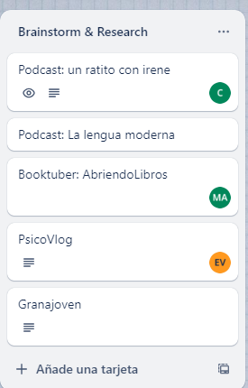
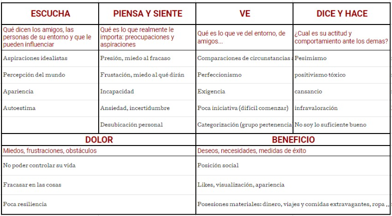
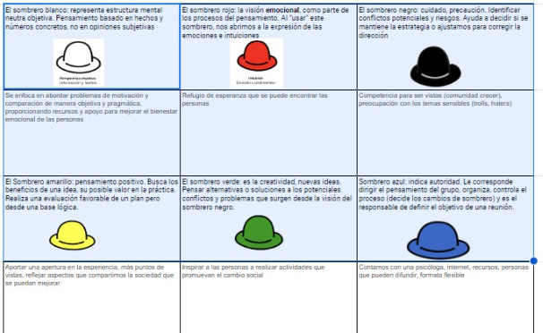
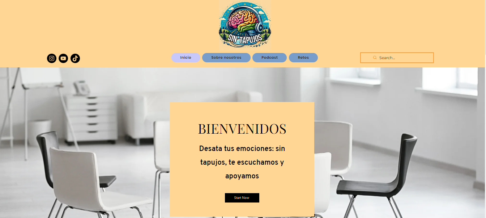
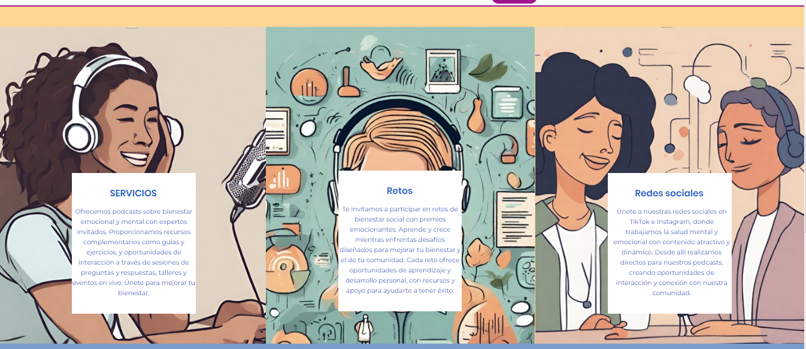
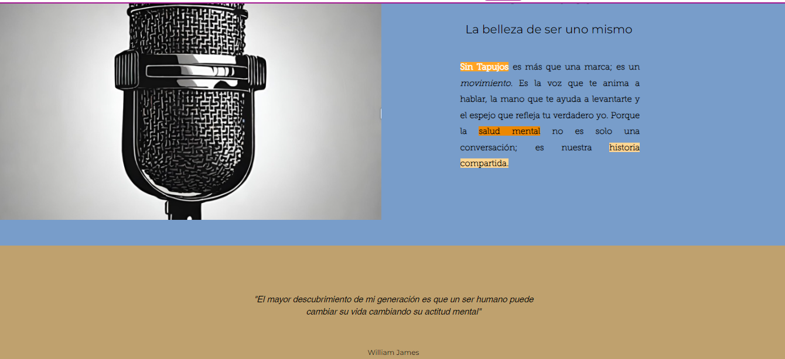
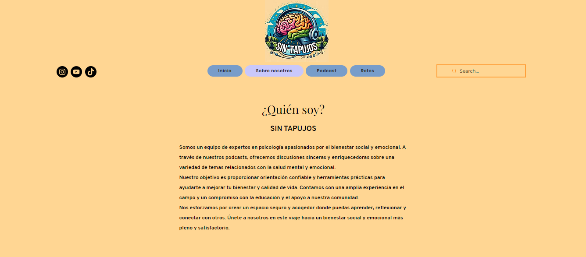
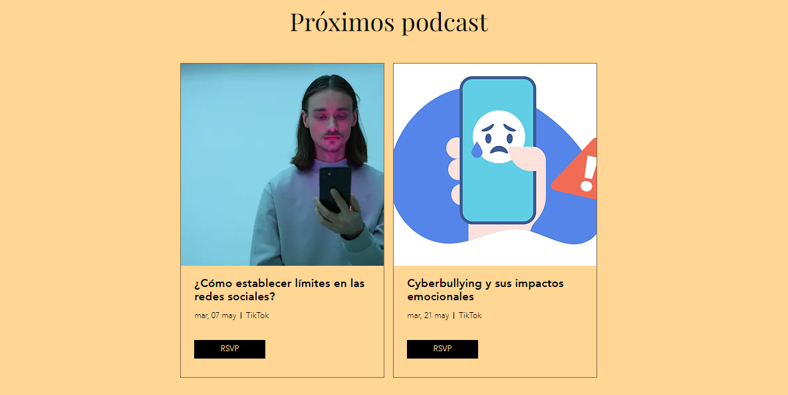
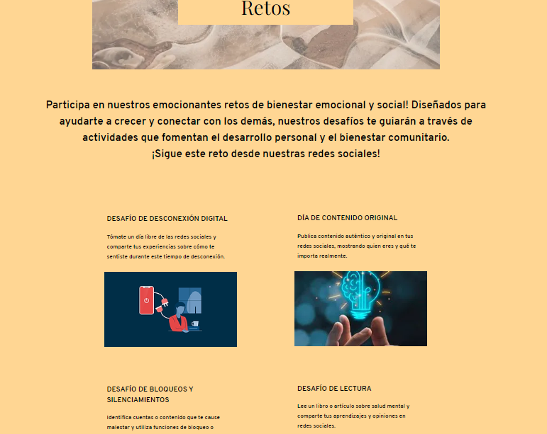

## (SIN TAPUJOS)  

(Plantilla para la creación de un proyecto en ideapolis)

Proyecto de Inteligencia Colectiva y Formación en la Empresa 

[Master en Gestión y Tecnologías de Procesos de Negocio](https://masteres.ugr.es/mbagestiontic/)

ETS Ingeniería Informatica y de Telecomunicación Univesidad de Granada  

----

**Titulo** : Sin Tapujos

**Autor(es)** Celia López, Elena Valenzuela y Maria Ángeles Muñoz

**Resumen** : Una empresa dedicada a podcasts sobre salud emocional y mental ofrece contenido valioso para mejorar el bienestar de las personas. Los podcasts cuentan con expertos que abordan temas relevantes y brindan consejos prácticos. Los oyentes pueden interactuar con la empresa a través de redes sociales, participando en debates y sesiones en vivo. Además, la empresa organiza retos sobre bienestar que promueven el crecimiento personal y la conexión con otros. Los participantes pueden ganar premios mientras fortalecen su salud emocional y mental en un entorno comunitario y de apoyo.

**logotipo** : 

**Slogan** (frase motivadora/inspiradora): Desata tus emociones: sin tapujos, te escuchamos y te apoyamos

**Hashtag** 
#BienestarEmocional
#SaludMental
#PodcastBienestar
#RetosDeBienestar
#CuidadoEmocional
#SaludMentalOnline
#DesafíosParaCuidarte
#CuidandoLaMente
#ConexiónEmocional
#AprenderYCrecer

**Licencia**    (usar una creative commons: revisar en https://creativecommons.org/licenses/?lang=es_ES) 
Utilizamos la licencia CCBY, ya que permite a otros compartir y adaptar nuestro trabajo con reconocimiento, lo que puede aumentar la visibilidad y fomentar la colaboración e innovación. Además, contribuye a la cultura libre y abierta.

**Fecha** : 2024

**Medios** (donde se tiene presencia): 

* Tiktok
* Instagram
* YouTube
* Página web

----

### ¿Quiénes somos?

Somos una empresa comprometida con el bienestar emocional y mental. Nuestro equipo está formado por expertos en psicología y salud mental que presentan podcasts informativos y enriquecedores. Fomentamos la interacción y el aprendizaje continuo a través de nuestras redes sociales, donde puedes participar en debates, sesiones en vivo y retos sobre bienestar.

### Misión

Nuestro objetivo es proporcionar orientación confiable y herramientas prácticas para ayudar a los clientes a mejorar su bienestar y calidad de vida. Contamos con una amplia experiencia en el campo y un compromiso con la educación y el apoyo a nuestra comunidad.

#### Vision

Ser la plataforma líder y referente en la creación de espacios de diálogo y aprendizaje sobre salud mental y emocional, desde cualquier ubicación, donde cada voz encuentra eco en una comunidad comprometida y empática. Aspiramos a transformar la percepción de la salud mental a través de contenido accesible, interactivo y enriquecedor, fomentando una sociedad donde hablar abiertamente de nuestras emociones y desafíos sea no solo aceptado, sino celebrado. Nuestra visión es construir un puente de conexión y soporte que empodere a individuos de todas las edades y culturas a alcanzar un bienestar integral y duradero

Esta visión refleja tanto la misión educativa como la social de la empresa, promoviendo un cambio en la cultura del diálogo sobre la salud mental y buscando impactar positivamente en la comunidad a largo plazo

----- 

### Metodología

**Identificación de competencias y oportunidades**

Análisis de Fortalezas: Las tres personas del equipo evaluamos nuestras habilidades individuales, identificando competencias clave en redes sociales, bienestar, psicología, y habilidades informativas y documentales.

Definición de la Idea de Negocio: Utilizando nuestras fortalezas, decidimos  crear una empresa centrada en producir podcasts que aborden temas de salud emocional y mental, especialmente en el contexto de las redes sociales.

### Etapa 1: Ideación de proyecto 

La ideación del proyecto la hicimos mediante la aplicación Trello, herramienta de gestión de proyectos basada en el sistema Kanban, que utiliza tarjetas y tableros para organizar tareas y actividades en equipo.
En la que fuimos desarrollando una lluvia de ideas de proyectos en los que queríamos inspirarnos.

Y seguimos con la lluvia de ideas en la aplicación Milanote, que es en la que más hemos trabajado y donde hemos ido todas las ideas para nuestro proyecto, como slogan, paleta de colores, logo, palabras clave, actividades que queremos realizar, videos de ayuda, retos que hacer, como puede verse en la siguiente imagen.

**¿Como surge el proyecto?**

En el contexto posterior a la pandemia de COVID-19, observamos un aumento notable en el uso de redes sociales, un fenómeno que, aunque facilitó nuevas formas de conexión social, también contribuyó a un incremento en los niveles de ansiedad y depresión entre los usuarios. Reconociendo la penetración y la capacidad de interacción que ofrecen estas plataformas, identificamos una oportunidad única para transformar cómo las personas interactúan en línea en relación a su salud mental. Así surgió la idea de crear una comunidad digital donde el bienestar emocional sea el foco, un lugar donde los usuarios puedan expresarse libremente, compartir sus experiencias sin temor al juicio y recibir apoyo en un entorno controlado y positivo. Nuestro objetivo es redefinir la interacción en redes sociales para hacer de estas un espacio seguro que fomente el diálogo abierto y la salud mental.

**Investigación de campo**   Desk research propuestas inspiradoras para el proyecto) 

* Para el análisis de competencia utilizamos **BuzzSumo** para analizar el contenido más compartido y las tendencias y ver en que temas estan interesados los usuarios de redes sociales.
* Para consultas de directrices y mejores prácticas no ayudamos en **Mental Health America**, **World Health Organization** y **National Institute of Mental Health**
* Para coger ideas inspiradoras: **Podcast: un ratito con irene** https://www.ivoox.com/podcast-un-ratito-irene_sq_f1762510_1.html y **PsicoVlog** https://www.youtube.com/@psicovlog

#### Necesidad/oportunidad

La creciente conciencia sobre la salud mental y la prevalencia de problemas emocionales entre los jóvenes y adolescentes presentan una necesidad urgente y una oportunidad de mercado para una empresa que ofrezca servicios de salud mental accesibles y adaptados a la era digital. La digitalización y la afinidad tecnológica de los jóvenes facilitan la implementación de una plataforma en línea que pueda superar barreras geográficas y socioeconómicas, proporcionando un espacio seguro y relevante para este grupo demográfico. Esta empresa no solo tiene el potencial de llenar un vacío en el acceso a recursos de salud mental, sino que también puede liderar innovaciones en la prestación de estos servicios, aprovechando tecnologías avanzadas y formando colaboraciones estratégicas con instituciones educativas y organizaciones de salud.

#### Motivación de la propuesta

La propuesta de crear una comunidad en línea enfocada en la salud mental y emocional surge como una respuesta innovadora a la creciente necesidad de apoyo psicológico, exacerbada por las secuelas de la pandemia de COVID-19. Este proyecto tiene como objetivo transformar el uso de las redes sociales, tradicionalmente criticadas por sus efectos negativos en la salud mental, en herramientas que promuevan un ambiente seguro y de apoyo. Al fomentar un diálogo abierto y desestigmatizado, la plataforma no solo actúa como un recurso de apoyo, sino también como un medio educativo, aumentando la comprensión pública y mejorando las políticas sobre salud mental.

Utilizando tecnologías avanzadas y accesibles, esta comunidad en línea propone un acceso global a recursos de salud mental, superando barreras geográficas y socioeconómicas. Con funciones como la inteligencia artificial para la moderación y personalización, la plataforma busca ofrecer intervenciones proactivas y personalizadas, creando así un espacio donde los usuarios no solo encuentren soporte sino también una comunidad resiliente y empática. Esta iniciativa representa una dirección revolucionaria en cómo las interacciones digitales pueden estructurarse para mejorar significativamente el bienestar emocional y la salud mental a gran escala.

#### Personas/Usuarios

Análisis del Público: A través de una serie de preguntas sobre los intereses, miedos, medidas de éxito y comportamientos de su público potencial, se identificaron los efectos negativos de las redes sociales, como las comparaciones y el miedo al fracaso.

Perfil del Usuario: Con esta información, se determinó que el contenido del podcast debería enfocarse en abordar las aspiraciones idealistas y los desafíos emocionales relacionados con el uso de redes sociales, por lo que los usuarios que más frecuencias las redes sociales, son los jóvenes y adolescentes, ya que es el público con más actividad en redes sociales y al que más le repercute este tipo de problemas de salud emocional.

### Etapa 2: Prototipar / productos 

(Productos que has desarrollado y como se plantea la integración de los diferentes medios, pon los que uses) 

* Imagen visual (Portada / Diseño de Interfaz) y herramienta usada

Se ha creado un diseño de interfaz limpio y atractivo que refleja un ambiente acogedor y seguro, utilizando una paleta de colores azules y naranjas para no sobrecargar visualmente a los usuarios. La portada destaca accesos directos como podcast y retos

* Redes sociales
  Se han planificado perfiles en plataformas como Instagram, TikTok y YouTube. Estos perfiles ofrecerán contenido  y campañas de concienciación sobre la salud mental, además de servir como puntos de contacto directo y apoyo entre la comunidad. Ademas desde estos perfiles podrán interactuar en los directos que se hagan desde las redes sociales y participar en los retos. Los contenidos de estas redes sociales estarán directamente vinculados con la plataforma, permitiendo a los usuarios acceder a recursos completos o iniciar sesión para participar en discusiones y actividades desde los enlaces publicados en las redes sociales.

* Publicidad: banner (... )
  Se van a diseñar varios banners publicitarios desplegados en redes sociales y sitios web frecuentados por jóvenes, como plataformas de streaming. Las herramientas como canva con ayuda de generador de imagenes de inteligencia artificial serán de ayuda para crear estos elementos visuales.

  Aunque la interacción de los usuarios va a ser desde las redes sociales, disponemos de una pagina web que hemos hecho con wix, donde explicamos quienes somos, añadimos los retos que se van haciendo en las redes sociales con un enlace directo que te lleva a ellos y donde alojamos los podcast que hemos ido haciendo y los que se van a realizar recientemente.
  En la pagina web de inicio, se puede visualizar como predomina la paleta de colores naranjas y azules, en la que se reflejan nuestras redes sociales desde donde pueden interactuar los usuarios, una pequeña entrada de bienvenida y nuestro eslogan sin tapujos.
  

  Si continuamos bajando en la página de inicio, encontramos un apartado donde explican los servicios que ofrecemos, los retos y lo activos que estamos en redes sociales y unas frases que representan nuestra comunidad y objetivos.

     

  

  
  En la sección quienes somos, tenemos una breve introducción en la que explicamos quien esta detrás de sin tapujos.

  

  

  En la sección de podcast, podemos observar varios podcast que se han ido realizando, y los próximos podcast que se van a realizar y con la fecha correspondiente, aunque días antes los promocionamos por las historias de nuestras redes sociales.

   

   

   

  Y finalmente en la sección de retos, tenemos los retos que se estan realizando en la actualidad, lo cuales estan enlazados para dirigir a los usuarios a la red social que se están realizando.
  

  

  

  
  

  

### Etapa 3: Técnicas de evaluación utilizadas

Encuestas y Cuestionarios: Recopilar feedback sobre la usabilidad y el impacto percibido de la plataforma. 

Evaluaciones de Salud Mental: Utilizar herramientas de evaluación pre y post uso para medir cambios en la salud mental de los usuarios.

#### Test con usuarios (...) 

A los usuarios se le puede hacer tantos test relacionados con la manera en la que trabajamos y su evaluación con nuestro servicio, para saber en que aspectos podemos mejorar, tanto un test de evaluación sobre su salud mental para comprobar si los clientes estan obteniendo buenos resultados tras realizar nuestros servicios.

#### Preguntas frecuentes

Preguntas relacionadas con la experiecia del usuarios en la plataforma y nuestro servicio:
- ¿Cómo calificaría la facilidad de uso de nuestra plataforma?
- ¿Qué funcionalidades adicionales le gustaría ver implementadas en la plataforma?
- ¿Recomendaría nuestra plataforma a amigos o familiares? ¿Por qué sí o por qué no?

  Preguntas enfocadas en la evaluación del progreso de la salud mental del usuario:

  
-Desde que comenzó a utilizar nuestra plataforma, ¿ha notado algún cambio en su bienestar emocional o mental?
-¿Ha utilizado las herramientas de autoayuda proporcionadas en la plataforma? Si es así, ¿cómo calificaría su efectividad
-¿Ha participado en las sesiones de grupo o foros comunitarios? ¿Han sido útiles estas interacciones para usted?
-¿Siente que tiene suficiente acceso a recursos de apoyo profesional a través de nuestra plataforma?
-En una escala del 1 al 10, ¿cómo calificaría su estado de salud mental antes y después de usar nuestra plataforma?
  
  
  

### Conclusiones y trabajo futuro

* Grado de consecución del proyecto

  El éxito de nuestro proyecto se podrá evaluar en función de diversos indicadores clave. En primer lugar, la participación de la audiencia será fundamental, manifestada a través del número de descargas, suscripciones y la interacción en redes sociales. Además, las reseñas y comentarios que recibamos reflejarán cómo se ha recibido nuestro contenido y la satisfacción de nuestra comunidad.

Un aspecto clave del éxito será el impacto positivo que podamos generar en el bienestar emocional y mental de nuestra audiencia. Este efecto se podrá medir por la calidad y cantidad de testimonios de los oyentes sobre cómo los episodios han influido en sus vidas, así como por el cambio en el nivel de conciencia sobre temas de salud mental y emocional.

También será importante haber cumplido los objetivos iniciales planteados, tales como aumentar la concienciación sobre el bienestar social y emocional, brindar herramientas prácticas a los oyentes, y crear una comunidad comprometida. Además, el reconocimiento de la industria, como premios o menciones, será un indicador adicional de nuestro éxito.
  
* Problemas identificados  (técnicos / sobre la idea inicial / planificacion… )

  **Problemas técnicos**

  Distribución: El primer problema que nos surgio era desde que plataforma de distribución iban a ser las más adecuadas para los podcast y la interacción.

**Problemas sobre la idea inicial**

Definición de la audiencia: En un principio la definición de la audiencia no estaba lo suficientemente clara.

Competencia: La idea que teníamos principalmente contaba con bastante competencia.

Nombre del proyecto: Algunos nombres ya estaban escogidos por otras empresas.

**Problemas de planificación**

Interacción con la audiencia: No se tenía completamente claro como se iba a interactuar con la audiencia a través de un podcast.

**Problemas de adaptabilidad**

Retroalimentación de la audiencia: Como conseguir la capacidad de escuchar y responder a la retroalimentación de la audiencia para mantener el ínteres del oyente.

**Obstáculos adicionales**

Generalidad de la conciencia sobre salud mental: La amplitud del tema puede resultar en un alcance limitado, lo que podría requerir un reenfoque del proyecto o una mayor definición de los temas. La evaluación precisa de la temática depende del feedback de la comunidad.
  
* Propuestas de mejora (por qué consideras que merece la pena continuar)
  
Mejoras Técnicas: Invertir en infraestructura tecnológica para asegurar que la plataforma pueda manejar un mayor volumen de usuarios simultáneamente y sin fallos.
Adaptación de Contenido: Implementar mecanismos de feedback en tiempo real para ajustar y alinear mejor el contenido con las necesidades y preferencias actuales de los usuarios.
Engagement de Usuarios: Desarrollar estrategias para incentivar la participación activa, como la gamificación o recompensas por interacciones

* Posible interés del proyecto (¿ Quien podría  colaborar / involucrarse en el proyecto? ¿viable?)
  
Colaboraciones Institucionales: Escuelas, universidades y organizaciones no gubernamentales dedicadas a la salud mental podrían estar interesadas en colaborar para expandir el alcance y la efectividad de la plataforma.
Involucramiento de Expertos: Psicólogos, terapeutas y expertos en salud mental pueden contribuir con contenido especializado y apoyar las funciones de moderación y asesoramiento.
Viabilidad: El proyecto es viable a largo plazo con las asociaciones adecuadas y el financiamiento continuo, dado el creciente reconocimiento de la importancia de la salud mental y el bienestar emocional.

Referencias y recursos: 

* Artículos:
https://www.comunidad.madrid/servicios/salud/bienestar-emocional-salud

https://www.infocop.es/recomendaciones-de-mhe-para-conseguir-comunidades-mentalmente-saludables/

* Productos utilizados
Canva: Para el diseño de contenido visual
Trello: Para la gestión de proyectos y seguimiento del progreso de las tareas
Microsoft Teams: Para la comunicación interna del equipo
Wix: Para la creación rápida de sitios web con capacidades extendidas mediante plugins

* Propuestas de mejora

-Implementar personalización mediante inteligencia artificial para ajustar recursos y recomendaciones.
-Ampliar los servicios ofreciendo talleres.
-ofrecer capacitación a educadores y padres.

----

**Referencias y recursos utilizados** :

* [Proceso UX](https://uxmastery.com/resources/process/)
* [Diseño de Experiencias UX](http://www.nosolousabilidad.com/articulos/uxd.htm) 
* [Métodos UX](https://mgea.github.io/UX-DIU-Checklist/index.html) 
* [MuseMap: ejemplo de experiencia UX](https://blog.prototypr.io/musemap-street-art-app-ux-case-study-9bec6a99823b)
* OCW 
  

* (Artículos ..  ) Através de OCW, hemos buscado varios cursos que nos son de gran ayuda para enfocar y seguir creciendo con nuestro proyecto y son los siguientes:
  -https://ocw.unican.es/course/view.php?id=24
  -https://ocw.unican.es/course/view.php?id=25
  -https://ocw.unican.es/course/view.php?id=26
  -https://ocw.unican.es/course/view.php?id=18
  -https://www.udemy.com/course/curso-inteligencia-emocional/
  -https://www.udemy.com/course/aprende-lenguaje-corporal-para-mejorar-tu-comunicacion/
  
* (Productos utilizados ) Canva, Trello, Microsoft Teams, Wix, Excel
* (Recursos tipo Imágenes, videos , etc.) Todas las imagenes han sido generadas con inteligancia artificial y canva

